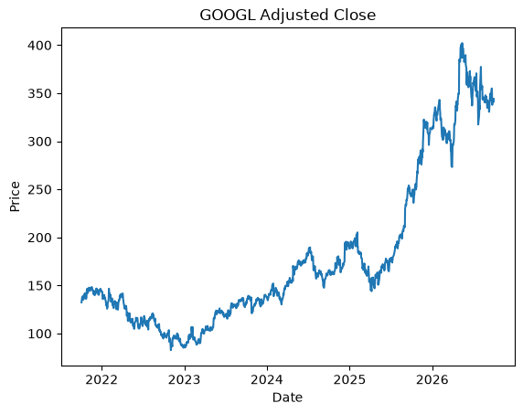
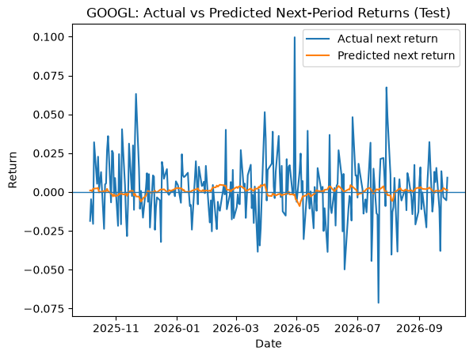
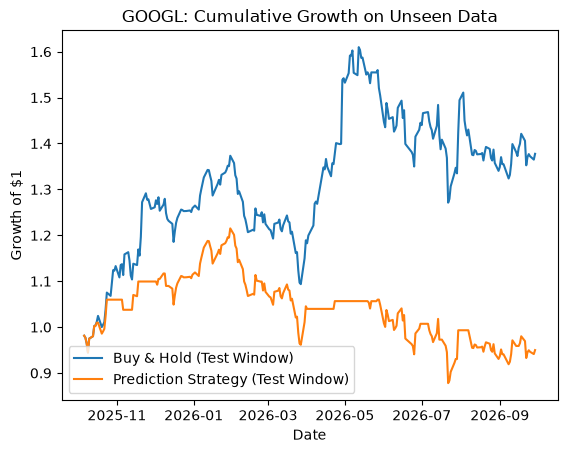

# GOOGL Return Forecasting & Backtest

Forecasting next-day returns of Alphabet (GOOGL) stock with a regularized linear model on lagged-return features, then turning the predictions into a simple long/flat trading strategy and evaluating it with standard risk-adjusted metrics.

## Overview

| | |
|---|---|
| **Data** | 5 years of daily GOOGL prices via `yfinance` (Oct 2021 to Sep 2026, fixed end date for reproducibility) |
| **Target** | Next-day simple return |
| **Model** | `StandardScaler` → `Ridge(alpha=1.0)` |
| **Evaluation** | MAE / RMSE vs. a mean-return baseline, directional accuracy; annualized return, Sharpe and Sortino vs. buy & hold |
| **Tools** | yfinance, pandas, scikit-learn, matplotlib |

## Approach

1. **Data**: download prices, compute simple and log returns.
2. **Features**: 5 lagged returns plus rolling mean/volatility windows (9 features); the target is the *next* period's return, so no future information leaks into the inputs.
3. **Chronological split**: first 80% for training (Oct 2021 → Oct 2025), last 20% (247 trading days) as an unseen test window. No shuffling.
4. **Model vs. baseline**: Ridge regression compared against always predicting the training-set mean return.
5. **Backtest**: go long for the next day when the predicted return is positive, stay in cash otherwise; compare with buy-and-hold over the same window.

<p align="center">
  
  
</p>

## Results

| Metric (test window) | Mean baseline | Ridge model |
|---|---|---|
| MAE | 0.01471 | 0.01492 |
| RMSE | 0.02006 | 0.02028 |
| Directional accuracy | 50.2% *(always "up")* | 46.2% |

| Strategy metric | Prediction strategy | Buy & hold |
|---|---|---|
| Annualized return | −5.1% | **+38.6%** |
| Sharpe ratio | −0.08 | **1.18** |
| Sortino ratio | −0.10 | **2.00** |
| Days invested | 69% | 100% |

<p align="center">
  
</p>

**Takeaway:** the model has no usable edge. It does not beat the naive baseline on error, gets the direction right less often than a coin flip, and the trading strategy built on it loses money while buy-and-hold gains ~39%. That is the expected outcome for daily returns predicted only from their own history, since markets quickly price in such simple patterns, and it is exactly what a clean, leakage-free backtest should reveal.

### Fixes in this version

- The backtest referenced a `test_returns` variable that was never defined in the notebook, so it only worked with leftover kernel state and its numbers (Sharpe 1.52) could not be reproduced. The strategy now explicitly applies each day's signal to the **next-day** return it predicts.
- Added a buy-and-hold column and directional accuracy so the strategy is judged against a fair benchmark.
- Pinned the download end date so the results are reproducible, removed a duplicated cell and an unused ARIMA import.

> Educational project only, not investment advice.

## Run it

```bash
pip install -r requirements.txt
jupyter notebook googl_return_forecasting.ipynb
```

Change `TICKER`, `YEARS_BACK`, or `TRAIN_RATIO` at the top of the notebook to try other stocks or periods.
